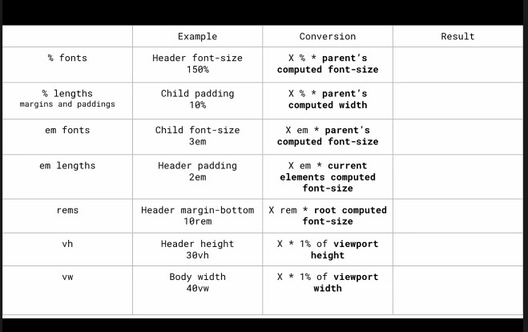
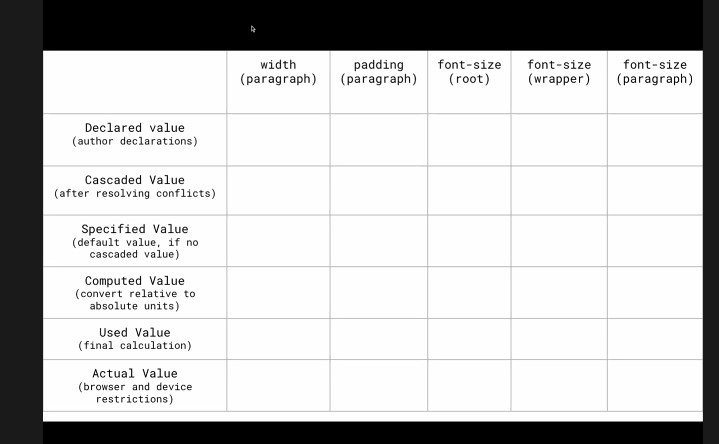

# Value Processing and Inheritance

- Every HTML element has every CSS property defined by default with an initial value
- Go to computed styles and click on Show All

## CSS Units

- px
- em
- rem
- %
- vh, vw
- ch

## Values

[CodeSandbox Link](https://codesandbox.io/p/sandbox/value-processing-7fcf2)
