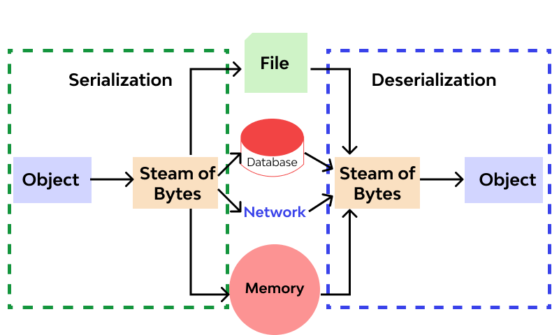
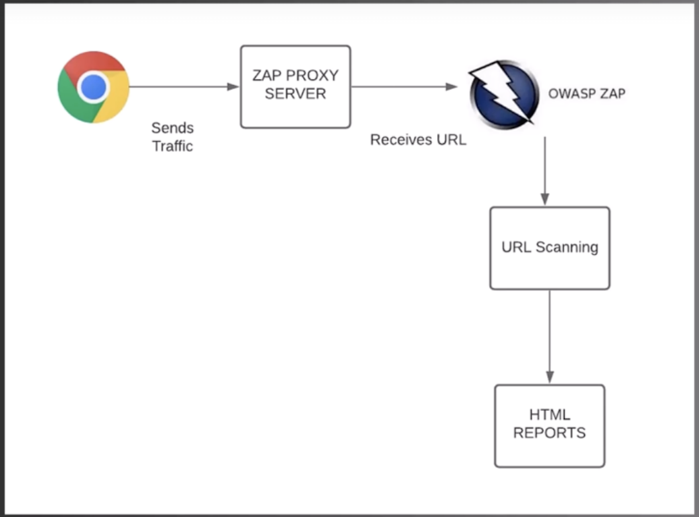
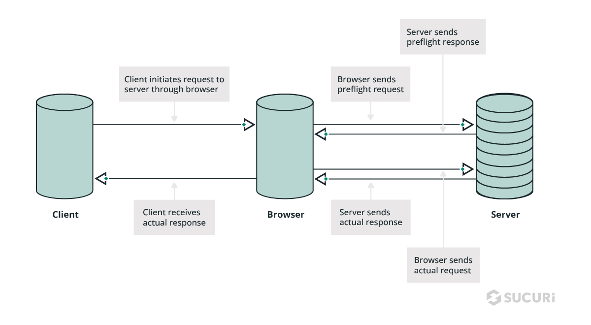

# Master OWASP Web Application Security

SKF Security Knowledge Framework - open source web project to understand security
ZAP Sed Attack Proxy - penetration testing tool
ASVS = Application security verification standard

# OWASP - Top 10
- Common vulnerabilities , real consequences
- Framework for prioritization

## A1 - Injection
  
- Injection attacks occur when an attacker is able to inject malicious code into an applications data input
  - SQL injection
  - OS commands
  - LDAP queries  
- Impact of Injection
  - Steal of manipulate data
  - Gain unauthorised attack
  - Disrupt the application’s normal operation
- Prevention and Mitigation
  - Input validation
  - Prepared statements
  - Parameterized queries

## A2 : Broken Authentication

- Authentication is the process of verifying the identity of the user, ensure that they are who they claim to be
- Common Authentication Flaws
  - Weak passwords - brute force attacks 
  - Insufficient session management - hijack valid sessions
  - Issues with password recovery - weak password recovery allows hackers to 
- Impact of Broken authentication
  - Unauthorised access
  - Data exposure
  - Identity theft
- Prevention and Mitigation
  - Strong password policies
  - Secure session mangement practices
  - Robust password recovery mechanisms

## A3 : Sensitive Data Exposure

- User credentials, financial data, health care records
- Sensitive data is at the core of many web applications and its a primary target for attackers
- Common Data Exposure Scenarios
  - Inadequate data encryption
  - Insufficient access controls
  - Flawed authentication and session management
- Impact of Data Exposure
  - Financial losses
  - Reputation damage
  - Legal ramifications
  - Loss of trust
- Prevention and Mitigation
  - Robust data encryption
  - Access control mechanisms
  - Secure authentication and session management

## A4 : XML External Entities (XXE)

- XML is used for data storage and transfer, can lead to vulnerabilities
- XXE occurs when attacker influence the procession of XML documents by including external entities
- Impact of XXE
  - Access to sensitive files
  - Disrupt the applications functionality
  - Execute arbitrary code
  - Application processes user-provided XML without proper validation, it can be manipulated to execute XXE attacks
- Prevention and Mitigation
  - Disable external entity references
  - Validate input
  - Use secure XML parsers

## A5 : Broken Access Control

- Role of access control : Defines who can access what parts of an application
- Occurs when developers do not properly enforce access restrictions
- Impact of Broken Access Control
  - Unauthorised access
  - Manipulation of data
  - Privacy breaches
- Common Vulnerability Scenarios
  - Lack of proper authentication checks
  - Missing authorisation. Checks
  - Predictable resource locations
- Prevention and Mitigation
  - Strong session management
  - Access control lists
  - Enforcement of role-based access

## A6: Security misconfiguration
  
- Default settings that are left unchanged
- Overly permissive permissions
- Unnecessary services or features
- Impact of Security misconfiguration
  - Data exposure
  - Unauthorised access
  - Manipulate an applications settings
- Common Misconfiguration scenarios
  - Leave default admin credentials unchanged
  - Expose sensitive information through error messages
  - Fail to restrict directory listings
- Prevention and Mitigation
  - Thorough testing
  - Regular review and update security settings

## A7 : Cross Site Scripting - XSS

- When an attackers can inject malicious scripts into web pages viewed by other users
- CSS - stored, reflected and DOM based attacks
- Stored XSS : Attacker sends payload and web application stores it and user web browser executes the code
  -  https://www.geeksforgeeks.org/understanding-stored-xss-in-depth/ 
  - 
- Reflected XSS : Attacker tricks user into clicking malicious link or visiting wrong website
  - https://www.geeksforgeeks.org/reflected-xss-vulnerability-in-depth/
  - 
- DOM based XSS  : Manipulating Document Object Model in user browser 
  - https://www.geeksforgeeks.org/dom-based-cross-site-scripting-attack-in-depth/
  - 

- Impact of XSS
  - Data theft
  - Session hijacking
  - Defacement of a web application
- Prevention and Mitigation
  - Input validation
  - Output encoding
  - Content Security Policy - CSP
  
## A8 : Insecure Deserialisation 

-  
- Insecure deserialisation lead to attacks that exploit the deserialisation process to execute malicious code
- Deserialisation : Process of converting data from a serialised format (often used for data storage or transmission) back into its original state
- Insecure deserialization occurs when untrusted data is deserialized without proper validation
- Impact of Insecure Deserialization
  - Execute arbitrary code
  - Take control of application
  - breach security
- Common Vulnerability Scenarios
  - Use of untrusted data from unauthenticated sources
  - Outdated or vulnerable deserializaton libraries
  - Insecure configurations
- Prevention and Mitigation
  - Validate and sanitize incoming data
  - Use safe deserialization libraries
  - Limit the use of deserialization

## A9 : Using Components with Known Vulnerabilities

- Components
  - Frameworks
  - Libraries
  - Plugins 
- Impact of Using Components with Known Vulnerabilities
  - Data breaches
  - Unauthorized access
  - Compromised application functinality
- Common Vulnerability Scenarios
  - Failing to update or patch components
  - Rely on unsupported or deprecated libraries
  - Not monitoring for new vulnerabilities
- Prevention and Mitigation
  - Regular vulnerability assessments
  - Updated with security advisors
  - Strict version control

## A10 : Insufficient Logging and Monitoring

- Importance of Logging and Monitoring
  - Identify security incidents
  - Troubleshoot issues
  - Trail of evidence
- It occurs when an application fails to generate adequate log records and these records are not properly monitored 
- Impact of Insufficient Logging and Monitoring
  - Delay incident response
  - Hinder threat detection
  - Unnoticed security breaches
- Common Vulnerability Scenarios
  - Not implementing comprehensive logging
  - Failing to monitor logs
  - Not having an indicident response
- Prevention and Mitigation
  - Logging strategy
  - Regulary log review
  - Automated monitoring systems

---

# Secure Coding and Development

## Principles of Secure Coding

- Principle 1 - Input Validation
  - SQL injection
  - Cross Site Scripting - XSS
- Principle 2 - Least Privilege
- Principle 3 - Defense in Depth
- Principle 4 - Secure by Design
- Principle 5 - Error Handling and Logging
- Principle 6 - Encryption
- Principle 7 - Patch Management
- Principle 8 - Security Testing

### OWASP Secure Coding Guidelines

- Secure coding is essential in preventing vulnerabilities and protect web applications from threats
- OWASP Cheat Sheet Series
- OWASP Development Guide
- OWASP Secure Coding Practices Quick Reference Guide
- OWASP Web SEcurity Testing Guide
- OWASP Application Security Verification Standard (ASVS)

## Input Validation and Output Encoding

- Importance of Input Validation : Ensures that the data your application receives is safe and within expected parameters
- Key Input Validation Techniques:
  -  Data type checking
  -  Input length limits
  -  Filter and sanitize user inputs
- Output Encoding for XSS Prevention
- Importance of Contextual Output Encoding : Tailors the encoding to the specific context where data is displayed
- Common Ouput Encoding Techniques
  - HTML encoding
  - URL encoding
  - JavaScript encoding
  - CSS encoding

## Authentication and Session Management

- Importance of Authentication
  - Process of verifying the identity of users before granting them access to your application 
- Key Authentication Techniques
  - Username and password
  - Multi-factor authenticaton (MFA)
  - Token-based
- Session Management and Security
  - Create, track, ad destroy sessions securely to prevent unauthorized access and session fixation attacks 
- Common Session Management Techniques
  - Secure session tokens
  - Session timeouts
  - Encrypting session data
- Implement Authentication and Session Management
  - Right authentication methods
  - Secure session handling
  - Proper session termination 

## Data Validation and Sanitization

- Data validation : Process of checking data inputs to ensure they adhere to specific rules and constraints
- Key Data Validation Techniques
  - Input Validation
  - Data type validation
  - Length checks

- Data Sanitization : Process of cleaning and filtering data inputs to remove potentially harmful elements
- Common Sanitization Techniques
  - Escaping user-generated content
  - HTML entity encoding
  - Parameterized queries for databases

- Implement Data Validation and Sanitization
  - Set clear data validation rules and apply sanitization methods consistently

## Error Handling and Logging

- Error Handling : Process of gracefully manage errors and exceptions within your application
- Key Error Handling Techniques:
  - Custom error messages
  - Exception handling
  - Informative error pages
- Role of Logging in Security
  - Track security incidents
  - Audit user activities
  - Troubleshooting issues
- Common Logging Techniques
  - Event logging
  - Error logging
  - Audit logging
- Security Considerations in Error Handling and Logging
  - Protect against attacks like information leakage and log manipulation
- Implementing Error Handling and Logging
  - Configure log levels
  - Handle errors securely
  - Regularly view logs
- Identify and resolve issues, maintain the security of application, ensure a positive user experience

# OWASP Tools and Projects

- OWASP Cheat Sheet Series
  - Encryption
  - Authentication
  - Input Validation
- OWASP Application Security Verification Standard (ASVS)
- OWASP Web Security Testing Guide
- OWASP Projects and Tools
  - Code review
  - Threat modeling
  - Penetration Testing 

## OWASP Web Security Testing Guide

- How to conduct thorough and methodical security assessments on web applications
- Key Sections
  - Information gathering : Critical phase, gather information about architecture and vulnerabilities
  - Authentication testing : handling tokens, testing code
  - Business logic testing  : vulnerabilities that are unique to business logic
- Supplementary Guide
  - AJAX
  - Web Service testing

## OWASP Application Security Verification Standard (ASVS)
   
- Provides basis for performing application security verification
- Establish security standards and verify
- Software is developed and deployed with security in mind
- ASVS Levels and REquirements
  - Level 1, critical and basic security controls
  - Level 2 and Level 3, advanced and stringent security measures
- Key Security Requirements
  - Authentication
  - Session management
  - Data protection
- How to use the ASVS - select appropriate level based on requirements
- Benefits
  - Assess application security
  - Security requirements
  - Tool for security professionals and developers

## OWASP ZAP (Zed Attack Proxy)

- It is popular and user friendly security testing tool that provides developers and securtiy professional with a means to find and fix security vulnerabilities in web apps
- Purpose of OWASP ZAP
  - Identify and mitigate security vulnerabilities in web applications
  - It as be used for manual testing or automation testing in CI pipeline
-  Key Features
  - Automated scanners
  - Interactive proxy tools
  - Extensive reporting capabilities
- How ZAP works
  - It works by acting as proxy between the browser and web applications
  - 
- Automated Scanners
  - SQL injection
  - Cross-Site Scripting (XSS)
- Interactive Tools
- Reporting and Remediation

---

# OWASP Resources and Documentation

- Importance of OWASP Resources
  - Expert insights
  - Guidelines and tools
  - Make informed decisions
- Key OWASP Resources
  - Documentation
  - Cheat sheets
  - Guides
  - Best practices
- OWASP Documentation Projects
  - Cheat sheet series
  - Development guide
  - Web security testing guide
- Supplementary Resources
  - Videos 
- Community Engagement
- Benefits
  - Stay up-to-date with latest security trends
  - Best practices
  - Gain access to supporting community

---

# Securing API's 

##  API Security Challenges

- Importance of API security
  - API are gateway to sensitive data and application vulnerability

- Key API Security
  - Authentication and authorization
  - Data exposure
  - Rate limiting
  - Input validation 

- Authentication and Authorization
- Data Exposure and Privacy
- Rate Limiting and Denial of Service (DoS) Attacjs
- Input Validation and Output Encoding

## OWASP API Security Top Ten

- Enable data exchange and integration between applications
- Top Ten API Security Risks
  - Broken Authentication
  - Execessive data exposure
  - Lack of rate limiting
- Broken Object Level Authorization
- Broken Authentication (identity of user)
- Execessive Data Expsoure - inadvertently leak exceed data
- Lack of Rate Limiting - DoS attack due to huge number of requests

## Authentication and Authorization in APIs

- AUthentication is the process of verifying the identity of users or systems accessing the API
- Common Authentication Techniques
  - API Keys
  - Tokens (such as OAuth and JWT(json web tokens))
  - username/password combinations

- Authorization is the process of determine what actions or data a user or system is allowed to access after authentication

- OAuth2.0 - widely used protocol for authorization
- JWT - JSON Web tokens

- Best practices of API Security:
  - Authentication methods
  - Session management
  - Least privilege principles
  - Regular review and test 

## Data Validation and Input Sanitization for APIs

- Data Validation : Process of checking incoming data to ensure it adheres to the expected format, structure and constraints
- Common Validation Techniques
  - Check data types
  - Lengths
  - Formats
  - Ranges 
- Input Sanitization
  - Process of cleaning or filtering data to remove potentially harmful characters or code

- Security Risks of Inadequate Validation and Sanitization
  - Injection attacks
  - Data leaks
  - Application level vulnerabilities

- Best practices
  - Implement input validation and sanitization at the API endpoints
  - Whitelists for input filtering
  - Validate data even after authentication

- Content Security Policies (CSP)
  - Additional level of security for web applications including APIs
  - They help mitigate XSS attacks by specifying the source of content that can be loaded  

## Securing Web Services

- Importance of Web Service Security
  - Used for data exchange between applications
- Key Security Consideration
  - Authentication
  - Authorization
  - Data Protection
  - Secure Communcation (HTTPS)

---

# Client Side Security

## Understanding Client-side security threats

- Focusses on safety and protection of code and data that run on user browsers
- Importance of Client-Side Security
  - Cross-Site Scripting (XSS)
  - Cross-Site Request Forgery (CSRF)
  - Data Leakage
- Common Client-Side Threats
  - XSS attacks - malicious code is injected into web pages
  - CSRF Attacks 
  - Clickjacking 
- Mitigating Client-Side Threats
  - Input validation
  - Output encoding
  - Content Security Policy (CSP) 
- Best Practices
  - Software and libraries up to date
  - Secure coding techniques
  - Security test and reviews 

## OWASP Secure Coding Practices for JavaScript

- Key Secure Coding Practices
  - Data validation
  - DOM manipulation
  - Security headers 
- Document Object Model (DOM) Manipulation
  - Avoid using innerHTML
  - textContent or createElement 
- Security Headers
  - CSP - content security policy 
- Best practices
  - Minimize use of global variables
  - Principle of least privilege
  - Regularly update libraries and dependencies

## Cross-site Scripting (XSS) Prevention

- Importance of XSS Prevention
  - Theft of senstive data
  - Session hijacking
  - Other security risks 
- Key XSS Prevention Techniques
  - Validate and Sanitize data
  - Escape output
  - Set security headers
- Secure Coding Best Practices
  - Avoid inline JavaScript
  - Minimize the use of global variables
  - Keep libraries and dependencies updated 

## Content Security Policy (CSP)

- CSP helps prevent the execution of malicious scripts by specifying the sources from which content can be loaded
- Key CSP Concepts
  - Scripts
  - Images
  - Styles 
- CSP Directives
  - 'default-src'
  - 'script-src'
  - 'style-src' 
- Reporting mechanisms
- Implementing CSP
- Benefits
  - Prevention of XSS attacks
  - Protectin against data inejction
  - Enhanced security for users

## Cross-Origin Resource Sharing (CORS)

- Importances of CORS
  - Prevent unauthorized cross-origin requests
  - Safeguard user data and integrity 
- Same-Origin Policy : restricts web pages from making requests to domains other than their own
- How CORS Works
  - [link](https://blog.sucuri.net/2024/06/cross-origin-resource-sharing.html)
  - 
- Common CORS Headers
  - 'Access-Control-Allow-Origin'
  - 'Access-Control-Allow-Methods'
  - 'Access-Control-Allow-Headers' 
- Implementing CORS
  - Configure your web server to include the necessary headers in HTTP responses
  - 'Origin'
- Benefits
  - Enable cross-origin communication
  - Enhance functionality
  - Promote a secure and controlled environment 

---

# Web Application Security Assessment

## Introduction to Security Assessment

- Security Assessment is the process of evaluating the security of a web application through various methods like testing, analysis and reviewing

- Importance of Security Assessment
  - Data breaches
  - Unauthorized access
  - Security threats 
- Types of Security Assessments
  - Vulnerability assessments
  - Penetration testing
  - Code reviews
  - Security audits 
- Vulnerability Assessment
  - Outdated software
  - Misconfigurations
  - Weak authentication methods 

## OWASP Testing Guide

- Ensure that applications are secure and resilient to security threats and vulnerabilities
- Key Features of Testing Guide
  - Web application architecture
  - Authentication
  - Session management
  - Data validation
  - Input Validation and Encoding
    - SQL injection
    - Cross Site Scripting (XSS) 
- Common Vulnerabilities and Exploits
  - CSRF
  - Security misconfigurations
  - Insecure deserialization

## Manual and Automated Testing Techniques

- Manual testing can uncover vulnerabilities that automated tools might miss
- Manual Testing Techniques
  - Source code reviews
  - Penetration testing
  - Threat modeling 

- Automated testing involves using software tools and scripts to identify vulnerabilities and weaknesses
- Automated testing is faster and cover a large portion of an application
- Automated Testing Techniques
  - Vulnerability scanners
  - Static code analysis tools
  - (DAST) tools 

## Reporting Security Findings

- Key Components of a Security Findings Report
  - Executive summary
  - Assessment
  - Detailed findings
  - Risk assessment
  - Recommendations 
- Executive Summary
- Assessment Overview
- Detailed Findings
- Risk Assessment
- Recommendations for Mitigation
- Reporting Best Practices
  - Clear and concise language
  - Actionable recommendations
  - Balance between technical details and non-technical summaries 

---

# Security in the SDLC

## Integrating Securing in the Software Development Lifecycle

- Importance of SDLC Security Integration
  - Reduce the risk of vulnerabilities
  - Lowers security costs
  - Applications are built with security in mind
- Key Stages of the SDLC
  - Requirements gathering
  - Design
  - Development
  - Testing
  - Deployment
  - Maintenance 
- Secure SDLC Practices
  - Threat modeling
  - Security requirements
  - Secure design principles
  - Secure coding
  - Testing
  - Conitnuous monitoring 

## Secure Development Phases

- Key Secure Development Phases
  - Requirements
  - Design
  - Implementation
  - Testing
  - Maintenance 

- Secure Development in Requirements Phase
  - Security requirements
  - Potential threats
  - Compliance with security standards 
- Secure Development in Testing Phase
  - Vulnerability assessments
  - Penetration testing
  - Code reviews
- Best Practices
  - Integrate security in each phase
  - Train developers in secure coding
  - Adopt security tools and standards  

## OWASP SAMM (Software Assurance Maturity Model)

- Key components
  - Governance
  - Construction
  - Verification
- Security Practice Areas
  - Governance - governing software security practices
  - Construction - developing secure software
  - Verification - confirming the security of the software 
- Maturity Levels
  - Initial
  - Repeatable
  - Defined 
- Benefits
  - Improved software security
  - Security assurance
  - Alignment with industry standards  

## Building a Security Culture

- Key Elements of a Security Culture
  - Leadership support
  - Awareness and training
  - Clear policies
  - Continuous improvement 
- Benefits
  - Risk management
  - Reduced incidents
  - Compliance
  - Stronger reputation 
- Building a Security Culture
  - Security goals
  - Training and awareness
  - Employee involvement
  - Security successes 

---
